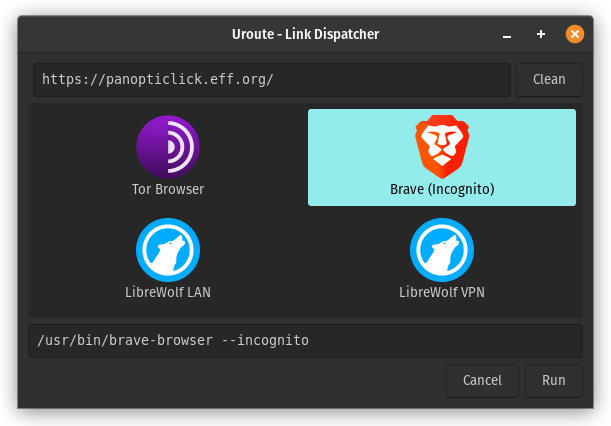

# Uroute: Route URLs to configured browsers

## Overview

Uroute is like the "Open URL with..." dialog on Android.

Suppose you have the [Tor Browser](https://www.torproject.org/projects/torbrowser.html.en),
[Brave](https://brave.com), and [Firefox](https://www.mozilla.org/en-US/firefox/new/)
installed, with Firefox profiles *LAN* and *VPN*. With Uroute as your default
browser, you can open each clicked URL in any of those browsers, in any
supported mode or profile.



The configuration for the scenario in the screenshot above looks like this:

```ini
[main]
default_program = brave-incognito

[program:tor-browser]
name = Tor Browser
command = /home/user/tor-browser_en-US/Browser/start-tor-browser
icon = /home/user/tor-browser_en-US/Browser/browser/chrome/icons/default/default128.png

[program:brave-incognito]
name = Brave: Incognito
command = brave-browser --incognito
icon = /usr/share/icons/hicolor/64x64/apps/brave-browser.png

[program:firefox-local]
name = Firefox Local
command = firefox --class firefox-profile-local -P Local --private-window
icon = /usr/share/icons/hicolor/64x64/apps/firefox.png

[program:firefox-vpn]
name = Firefox VPN
command = firefox --class firefox-profile-vpn -P VPN --private-window
icon = /usr/share/icons/hicolor/64x64/apps/firefox.png
```

See the [Configuration](#configuration) section below for more details.

This program was developed for and tested on Ubuntu 18.04 (Bionic). It should
work in other Freedesktop environments with Python 3 and GTK 3 installed.


## Installation

    $ sudo apt install python3-gi
    $ mkvirtualenv -p $(which python3) uroute
    $ pip install git+https://github.com/walterl/uroute.git
    $ ln -s /usr/lib/python3/dist-packages/gi $VIRTUAL_ENV/lib/python3.6/site-packages/


## Usage

    $ uroute https://fsf.org


## Features

* [X] Open command-line argument URL in any of the configured external browsers.
* [X] Detect if Uroute is the default browser, and install it as such.
* [X] Modify URL before opening it in the selected browser.
* [X] Modify command-line of configured browser launching it.
* [X] Extract URL from clipboard contents if no URL was specified.
* [X] Filter/clean URL before launching browser
  * [X] Remove tracking parameters
  * [X] Automatically unshorten short URLs
* [ ] Set default browser dynamically, based on URL
* [ ] GUI for managing configuration
* [ ] Improve browser detection: import configuration from installed browsers' XDG desktop entries
  * [ ] Create a browser configuration for each `[Desktop Action ...]`


## Tips

Assign a keyboard shortcut to Uroute. Opening a URL in Uroute is then as simple
as copying the URL and launching Uroute via the keyboard shortcut. This is
especially useful when you want to open a link from one browser in another.


## Configuration

The Uroute configuration file lives in `$XDG_CONFIG_HOME/uroute/uroute.ini`. On
Ubuntu that is `$HOME/.config/uroute/uroute.ini`.

It is created automatically and pre-populated with some crude browser detection
if that file does not exist.

It contains sections `main`, `logging` and a section prefixed with `program:`
for each configured browser.

### `main` section

The following keys are supported:

* `default_program`: Set the value to a *program ID* of a configured browser.
  See [Program sections](#program-sections) below.
* `ask_default_browser`: Set to `no` to avoid being asked to set Uroute as the
  default browser. This is set automatically after the user was prompted.
* `read_url_from_clipboard`: Set to `no` to avoid reading URLs from the
  clipboard, when no URL was specified.
* `clean_urls_rules_file`: Path to URL cleaning rules file. It defaults to
  `$XDG_DATA_HOME/uroute/rules.json` (`$HOME/.local/share/uroute/rules.json`).
  If the file is missing or contains invalid JSON, the ClearURLs
  [`data.min.js`](https://gitlab.com/KevinRoebert/ClearUrls/blob/master/data/data.min.json)
  is downloaded.

### `logging` section

*Note: If you don't understand this section, you can safely ignore it.*

This section is optional, and provides control over the Python logging
configuration. All keys and values are passed to
[`logging.basicConfig`](https://docs.python.org/3.6/library/logging.html#logging.basicConfig),
and should be formatted accordingly.

The default *level* is `INFO` and the default *format* is
`%(levelname)s %(message)s`.

### `program:` sections

Each browser and execution mode needs to be configured in a separate section.
The section title is in the form `program:some-browser`, where `some-program`
is the browser's *program ID*. The *program ID* can be used to set the
`default_program` in the `main` section.

```ini
[program:brave-incognito]
name = Brave: Incognito
command = brave-browser --incognito @URL
icon = /usr/share/icons/hicolor/64x64/apps/brave-browser.png
```

Here the *program ID* is `brave-incognito`.

`name` is the browser's display name.

`command` is the full command used to launch the browser. The string `@URL`
is substituted for the URL to open. If not specified, the URL is appended to
the end.

`icon` is the full path to the display icon.


## Thanks

* [ClearURLs](https://gitlab.com/KevinRoebert/ClearUrls) for its [URL cleaning rules](https://gitlab.com/KevinRoebert/ClearUrls/blob/master/data/data.min.json).
